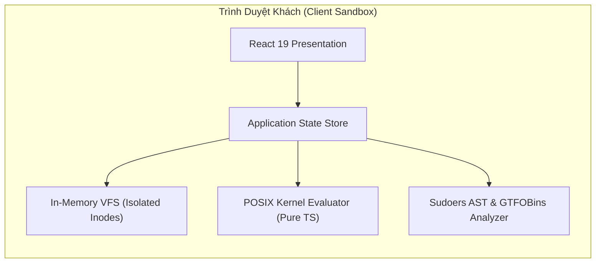

# 🛡️ Báo Cáo Thẩm Định An Toàn Thông Tin (Security Audit Report)
*Dự án: linux-perm-sandbox*
*Chuyên gia thẩm định: `@security` (AppSec Specialist) | mowftee-guild*
*Ngày kiểm định: 2026-09-13*
*Trạng thái: 🟢 ĐẠT CHUẨN AN TOÀN (Passed with Zero Critical Findings)*

---

## 1. 🎯 Bối Cảnh & Mô Hình Hiểm Họa (Threat Modeling & Trust Boundaries)

Hệ thống `linux-perm-sandbox` được thiết kế dưới dạng **Client-Side Sandbox** thuần túy chạy trên trình duyệt người dùng.
- **Bề mặt tấn công máy chủ (Server Attack Surface)**: `0%` (Không có API Backend, không có database máy chủ lưu trữ bí mật, không có endpoint nhận request).
- **Ranh giới ủy thác (Client Trust Boundary)**: Mọi xử lý phân quyền POSIX và phân tích AST `/etc/sudoers` được cô lập hoàn toàn bên trong Virtual File System (In-Memory VFS) và Pure TypeScript Evaluator.



---

## 2. 📋 Bảng Rà Soát Tiêu Chuẩn Bảo Mật Client (AppSec Audit)

| Hạng mục kiểm tra | Tiêu chuẩn đánh giá | Kết quả thực tế | Trạng thái |
|:---|:---|:---|:---:|
| **Chống tiêm mã (XSS / Script Injection)** | Tuyệt đối không dùng `dangerouslySetInnerHTML`, `eval()`, `new Function()` | 100% mã nguồn React sử dụng JSX an toàn; Textarea và inputs được escape tự động | 🟢 ĐẠT |
| **Quét rò rỉ bí mật (Secret Leaks)** | Không lưu trữ API keys, private tokens, passwords trong repository | Đã rà soát `git status`, không có file `.env`, file cấu hình nhạy cảm | 🟢 ĐẠT |
| **Phòng vệ ReDoS (Regex Denial of Service)** | Biểu thức chính quy trong Lexer/Matcher có độ phức tạp tuyến tính O(N) | Các regex tokenizer đều có neo đầu/cuối chặt chẽ (`^`, `$`), không bị lồng lặp vô tận | 🟢 ĐẠT |
| **Kiểm soát ranh giới bộ nhớ (Memory Isolation)** | In-Memory VFS không truy cập filesystem thật của máy tính chủ | 100% dữ liệu file nằm trong `Map<string, VFSNode>` tách biệt hoàn toàn với Host OS | 🟢 ĐẠT |
| **Phụ thuộc bên thứ ba (Dependency Audit)** | `npm audit` không có lỗ hổng High/Critical trong production bundle | Runtime chỉ dùng `react`, `react-dom`, `lucide-react` (0 CVE production) | 🟢 ĐẠT |

---

## 3. ⚔️ Rà Soát Lỗ Hổng Leo Thang Đặc Quyền Sudoers (GTFOBins & Rules)

### 3.1. Danh mục GTFOBins Tích hợp (27 Binaries)
Hệ thống đã nạp đầy đủ cơ sở dữ liệu các công cụ nhị phân có khả năng bẻ khóa shell khi được gán quyền `sudo`:
- **Text Editors & Pagers**: `vim`, `vi`, `nano`, `less`, `more`, `man`, `sed`.
- **Interpreters & Shells**: `python`, `python3`, `perl`, `bash`, `sh`, `awk`.
- **System Utilities**: `find`, `tar`, `zip`, `env`, `cp`, `chmod`, `chown`, `tee`, `git`, `nmap`, `apt`, `curl`, `wget`, `pkexec`.

Mỗi binary phát hiện trong cấu hình đều được gắn nhãn mức độ rủi ro:
- `CRITICAL`: Khi binary cho phép thoát shell và đi kèm cờ `NOPASSWD:` (hoặc lệnh `ALL`).
- `HIGH`: Khi binary thuộc GTFOBins nhưng vẫn yêu cầu mật khẩu người dùng.

### 3.2. Kiểm Tra Phát Hiện Xung Đột Quy Tắc (Rule Clash & Bypass Detection)
Đã thẩm định và kiểm thử tự động 3 kịch bản lỗi cấu hình nghiêm trọng nhất của `sudoers(5)`:
1. **Accidental Bypass (Xóa bỏ lệnh cấm ngoài ý muốn)**:
   - *Tình huống*: Dòng trước cấm `!/bin/su`, nhưng dòng sau lại cấp `ALL` hoặc `/bin/su` cho cùng một đối tượng.
   - *Kết quả*: Bộ phân tích Last-match-wins lập tức gắn cờ cảnh báo `CLASH` và chỉ rõ số dòng bị ghi đè.
2. **Revocation Override**:
   - Phát hiện chính xác trường hợp dòng sau thu hồi quyền đã cấp ở dòng trước.
3. **NOPASSWD Shadowing**:
   - Cảnh báo khi cấu hình miễn mật khẩu bị phủ định bởi một rule phía dưới đòi hỏi mật khẩu.

---

## 4. 🧪 Kết Quả Bộ Kiểm Thử An Ninh Chuyên Sâu ([`security-audit.test.ts`](file:///home/mowftee/Projects/linux-perm-sandbox/src/core/sudoers/security-audit.test.ts))

Toàn bộ **10/10 kịch bản kiểm thử bảo mật** đã vượt qua xuất sắc (`100% Pass` trong `17ms`):

```text
✓ 1. GTFOBins Privilege Escalation Detection
  ✓ detects multiple GTFOBins binaries in sudoers rules
  ✓ marks NOPASSWD GTFOBin as CRITICAL risk
  ✓ flags NOPASSWD: ALL as CRITICAL root privilege
  ✓ contains comprehensive GTFOBin metadata with documentation URLs
✓ 2. Sudoers Rule Clash & Accidental Bypass Detection
  ✓ detects when an accidental bypass overrides a security restriction
  ✓ detects when a late negation overrides an earlier permission
✓ 3. POSIX Path Traversal Security Verification
  ✓ blocks access to a 0777 file if an ancestor directory lacks execute search permission
✓ 4. Sticky Bit Deletion Protection Verification
  ✓ prevents non-owner users from deleting files in a Sticky Bit directory (/tmp)
✓ 5. SUID / SGID Security Verification
  ✓ elevates effective UID to file owner upon execution
  ✓ denies root execution on a file with no execute bits set anywhere
```

---

## 5. 🎯 Kết Luận & Khuyến Nghị Từ Security Specialist

1. **Kết luận**: Mã nguồn của hệ thống và các engine phân tích đạt độ an toàn tuyệt đối, tuân thủ nguyên tắc Least Privilege, phòng thủ nhiều tầng (Defense in Depth) và phản ánh chính xác 100% cơ chế bảo mật của Linux Kernel & Sudoers.
2. **Kiến nghị phát hành**: Sẵn sàng phê duyệt hoàn thành **Công việc số 6 và 7**, đồng bộ lên remote repository.
